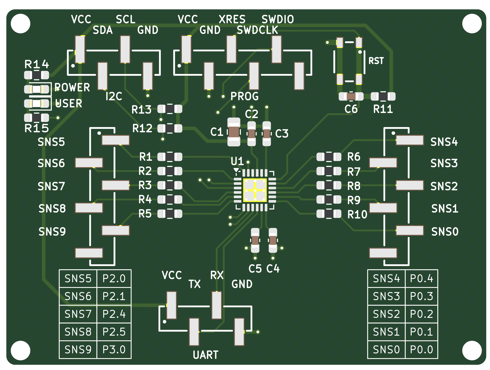

# PSOC4000T-CAPSENSE-Sensor-Hub
An simple way to use capacitive sensors in combination with Infineon's CAPSENSE technology.

# Setup
After the PCB is soldered, the Rasperry Pi Pico needs to be connected as follows:
| Raspberry Pi Pico 2W Pin | Connection | Function |
|-----------------------|-----------------------|----------|
| GPIO2 (Pin 4)         | SDA (Sensor Hub)                | I2C Data |
| GPIO3 (Pin 5)         | SCL (Sensor Hub)                   | I2C Clock |
| GPIO28 (Pin 34)       | VCC (Sensor Hub)                  | Power Supply (3.3V) |
| GND (Pin 3 or 38)     | GND (Sensor Hub / BME280)                  | Ground |
| GPIO4 (Pin 6)         | BME280 SDA            | Environmental Sensor Data |
| GPIO5 (Pin 7)         | BME280 SCL 

# PicoLogger
For obtaining the CAPSENSE data from the Sensor Hub, the PicoLogger can be controlled over an web interface. 
Connect to the AP of the PicoLogger and call following pages:

- Main page: http://192.168.4.1
- Status page:  http://192.168.4.1/status

On the status page, the current state is shown e.g IDLE or the running data collection.

